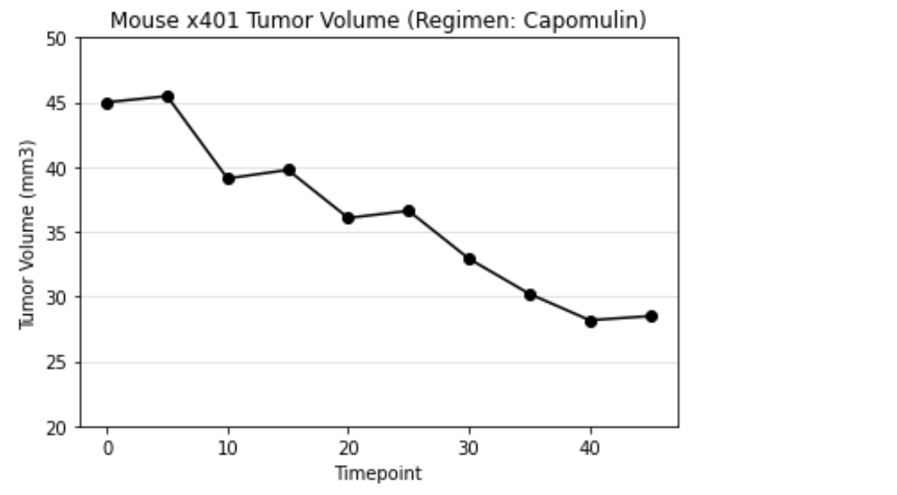

# Matplotlib Homework - The Power of Plots

* Look across all previously generated figures and tables and write at least three observations or inferences that can be made from the data. Include these observations at the top of notebook.

## Check the data for any mouse ID with duplicate time points and remove any data associated with that mouse ID.
There were originally 249 mice. Mouse with the Mouse ID: g989 was removed due to duplicate data, leaving 248 mice in the study.

## Summary statistics table consisting of the mean, median, variance, standard deviation, and SEM of the tumor volume for each drug regimen.

## Show the total number of measurements taken for each treatment regimen throughout the course of the study.

DataFrame.plot()

pyplot

## Show the distribution of female or male mice in the study.

DataFrame.plot()

pyplot

##  The Final tumor volume of each mouse across four of the most promising treatment regimens: Capomulin, Ramicane, Infubinol, and Ceftamin. 

Calculate the quartiles and IQR and quantitatively determine if there are any potential outliers across all four treatment regimens.

* The interquartile range of Tumor Volume for Capomulin is: 7.781863460000004
* The values below 20.70456164999999 could be outlier for Capomulin
* The values above 51.83201549 could be outlier for Capomulin
* The interquartile range of Tumor Volume for Ramicane is: 9.098536719999998
* The values below 17.912664470000003 could be outlier for Ramicane
* The values above 54.30681135 could be outlier for Ramicane
* The interquartile range of Tumor Volume for Infubinol is: 11.477135160000003
* The values below 36.83290494999999 could be outlier for Infubinol
* The values above 82.74144559000001 could be outlier for Infubinol
* The interquartile range of Tumor Volume for Ceftamin is: 15.577752179999997
* The values below 25.355449580000002 could be outlier for Ceftamin
* The values above 87.66645829999999 could be outlier for Ceftamin

## The final tumor volume for all four treatment regimens and highlight any potential outliers in the plot by changing their color and style.

## Treatment with Capomulin  of tumor volume vs. time point for mouse x401.

## Treatment with Capomulin of tumor volume vs. mouse weight.

## The correlation coefficient and linear regression model between mouse weight and average tumor volume for the Capomulin treatment. 

The correlation coefficient between the average tumor volume and mouse weight is 0.84.

