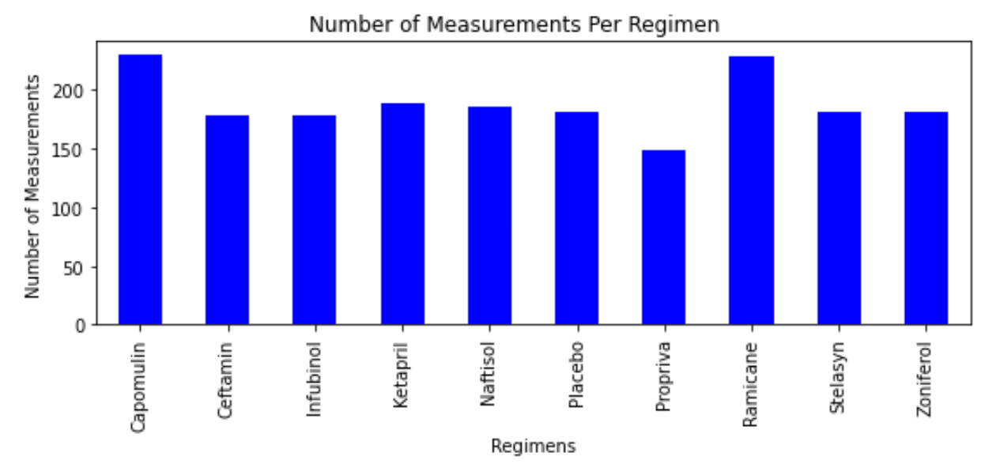

# Matplotlib Homework - The Power of Plots

## Observations
* The study had an almost equal distribution of male (51%) and female(49%) mice .

* The regimens Capomulin and Ramicane are comparable and seem to be the most effective, with the smallest average tumor volume,  lowest standard of deviation, and the lowest errors in the samples as compared to the other regimens. These two regimens also had the most number of samples.

* When using Capomulin:
    * The tumor volume decreases over time.
    * On average, the tumor sizes are larger in mice that are heavier.

* The results of this study are reliable:
    * There is only 1 outlier when looking at the regimens Capomulin, Ramicane, Infubinol, and Ceftamin.
    * The correlation coefficient between the average tumor volume and mouse weight is 0.84 when using Capomulin.

## Duplicate data
There were originally 249 mice. Mouse with the Mouse ID: g989 was removed due to duplicate data, leaving 248 mice in the study.

## Summary statistics for each drug regimen

## Total number of measurements taken for each treatment regimen

DataFrame.plot()

pyplot

## Distribution of female or male mice

DataFrame.plot()

pyplot

##  Capomulin, Ramicane, Infubinol, and Ceftamin quartiles, IQR  and outlier information

* The interquartile range of Tumor Volume for Capomulin is: 7.781863460000004
* The values below 20.70456164999999 could be outlier for Capomulin
* The values above 51.83201549 could be outlier for Capomulin
* The interquartile range of Tumor Volume for Ramicane is: 9.098536719999998
* The values below 17.912664470000003 could be outlier for Ramicane
* The values above 54.30681135 could be outlier for Ramicane
* The interquartile range of Tumor Volume for Infubinol is: 11.477135160000003
* The values below 36.83290494999999 could be outlier for Infubinol
* The values above 82.74144559000001 could be outlier for Infubinol
* The interquartile range of Tumor Volume for Ceftamin is: 15.577752179999997
* The values below 25.355449580000002 could be outlier for Ceftamin
* The values above 87.66645829999999 could be outlier for Ceftamin

## Tumor volume for all four treatment regimens

## Treatment with Capomulin of tumor volume vs. time point for mouse x401

## Treatment with Capomulin of tumor volume vs. mouse weight

## The correlation coefficient and linear regression model for mouse weight and average tumor volume for the Capomulin treatment

The correlation coefficient between the average tumor volume and mouse weight is 0.84.

